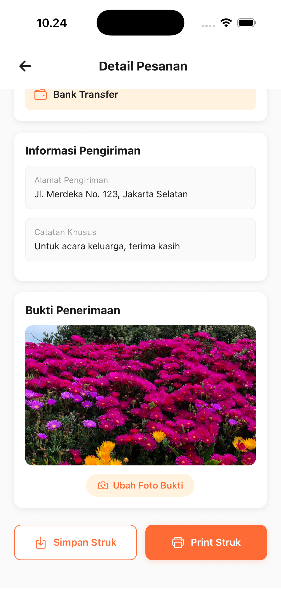
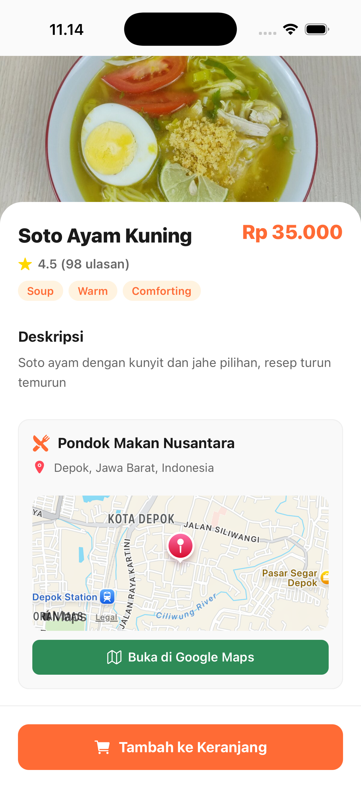
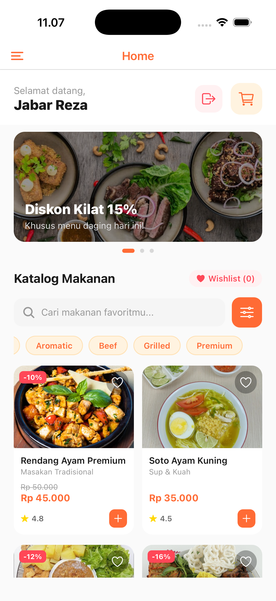
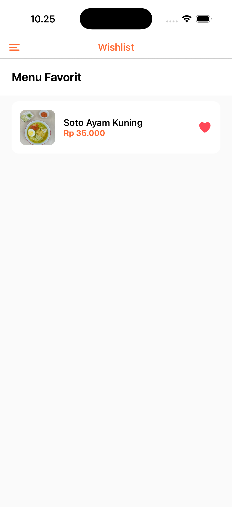

# FlavorDash

FlavorDash adalah aplikasi mobile berbasis React Native dan Expo yang dirancang untuk memudahkan pengguna dalam menjelajahi, memilih, dan memesan makanan secara cepat melalui perangkat mobile. Aplikasi ini menampilkan katalog produk, detail makanan, keranjang belanja, proses checkout, serta riwayat pesanan dalam satu pengalaman yang sederhana dan modern.

## Fitur Utama

- Login dan autentikasi pengguna
- Tampilan katalog makanan yang menarik
- Detail produk lengkap dengan informasi menu
- Keranjang belanja dan proses pembayaran
- Halaman wishlist dan riwayat pesanan
- Integrasi mock API untuk data produk dan transaksi

## Screenshot Aplikasi

Berikut beberapa tampilan utama dari aplikasi FlavorDash:

<div align="center">
  <table>
    <tr>
      <td align="center">
        <br/>
      </td>
      <td align="center">
        <br/>
      </td>
    </tr>
    <tr>
      <td align="center">
        <br/>
      </td>
      <td align="center">
        <br/>
      </td>
    </tr>
  </table>
</div>

## Analisis

### 1. Alasan Penggunaan Flexbox dan Ukuran Proporsional

Flexbox digunakan karena sangat cocok untuk menyusun elemen UI secara fleksibel dan konsisten pada berbagai ukuran layar. Dengan Flexbox, komponen seperti header, konten, tombol, dan card produk dapat diatur secara otomatis agar tetap rapi saat digunakan di layar kecil maupun besar. Penggunaan ukuran proporsional seperti `flex` dan persentase juga penting agar tampilan tidak pecah saat perangkat memiliki resolusi yang berbeda. Pendekatan ini membuat desain menjadi lebih responsif, mudah dipelihara, dan nyaman digunakan oleh pengguna.

### 2. Perbedaan Stateful Authentication dan Stateless Authentication (JWT)

Stateful Authentication menyimpan informasi sesi pengguna di server, sehingga server perlu mengingat status login setiap pengguna. Biasanya pendekatan ini membutuhkan penyimpanan session ID di server dan pemeriksaan berulang saat pengguna mengakses layanan.

Sementara itu, Stateless Authentication tidak menyimpan sesi di server. Informasi pengguna disimpan langsung di token, seperti JWT, yang dikirimkan ke setiap request. Server hanya memverifikasi token tersebut tanpa perlu mengingat sesi sebelumnya.

### 3. Alasan Pemilihan JWT pada Aplikasi Mobile

JWT dipilih karena cocok untuk aplikasi mobile yang membutuhkan autentikasi sederhana, cepat, dan efisien. Token dapat disimpan di perangkat dan dikirimkan saat diperlukan, sehingga proses login menjadi lebih ringan dan tidak bergantung pada session storage di server. Selain itu, JWT juga mendukung komunikasi yang lebih fleksibel untuk API dan cocok digunakan pada aplikasi yang memerlukan autentikasi antar request secara praktis.

## Cara Menjalankan Project

### 1. Install dependency

```bash
npm install
```

### 2. Jalankan aplikasi

```bash
npx expo start
```

### 3. Jalankan mock API

```bash
npm run mock-api
```

Mock API akan berjalan di:

```bash
http://localhost:3000
```

Endpoint sample:

```bash
http://localhost:3000/products
```